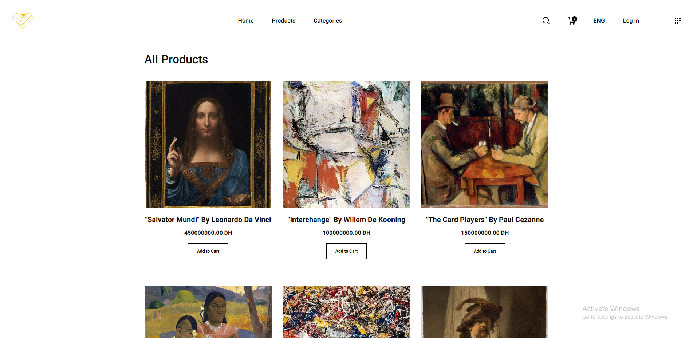
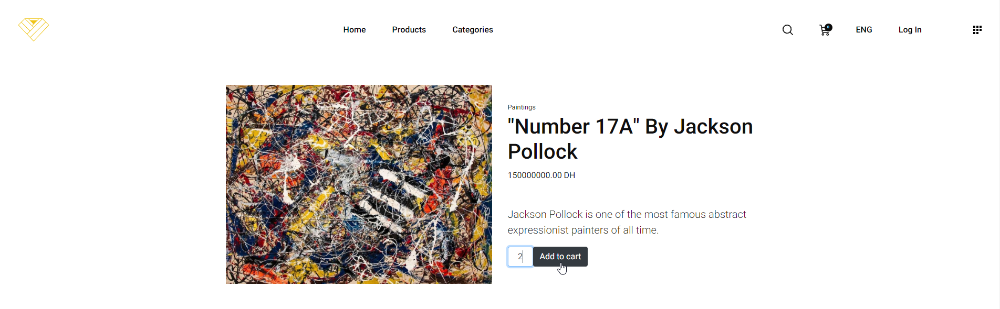
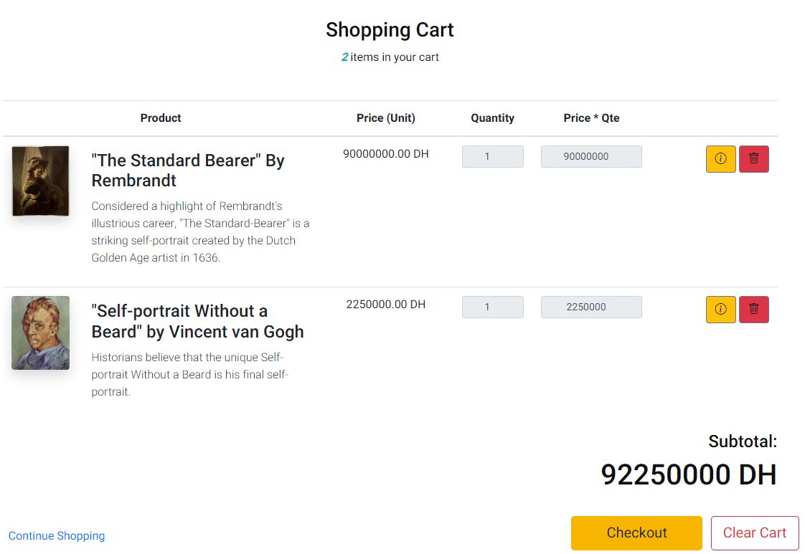
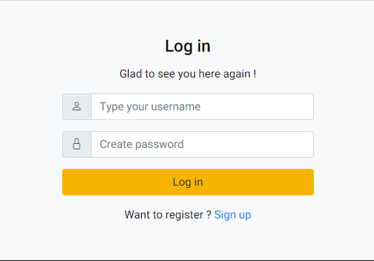
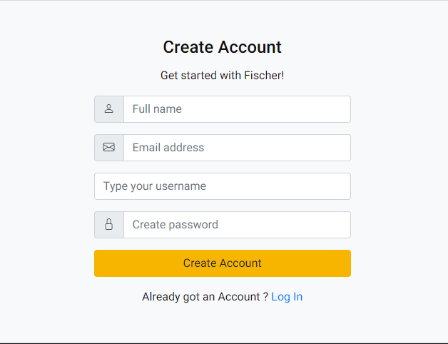
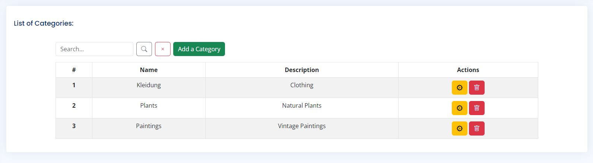
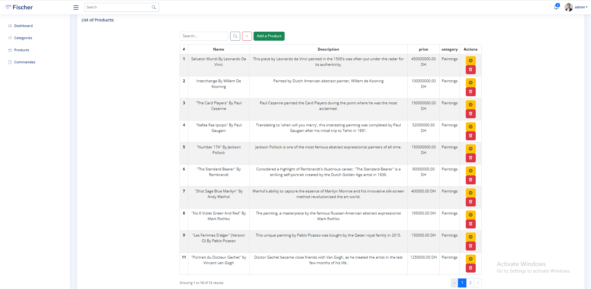
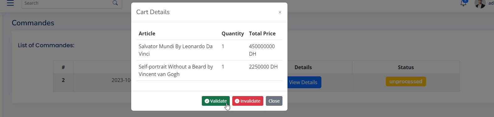
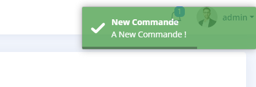

<br/>
<p align="center">
  <a href="https://github.com/0xW3ston/Operation-Fischer">
    
  </a>

  <h3 align="center">Fischer</h3>

  <p align="center">
    an E-Commerce website with basic features.
    <br/>
    <br/>
  </p>
</p>

    

## Table Of Contents

* [About the Project](#about-the-project)
* [Built With](#built-with)
* [Getting Started](#getting-started)
  * [Prerequisites](#prerequisites)
  * [Installation](#installation)
* [Roadmap](#roadmap)
* [License](#license)
* [Authors](#authors)

## About The Project

|  |  |
| ------------------------------------------------------------- | ----------------------------------------------------------- |
|   |     |
|    |  |
|    |    |
|    |                                                            |

Regarding this project, it was made to make somewhat of an abstract e-commerce website.

## Built With

Due to my focus on Real-Time communication. I ended up using:

* [Laravel v10](https://blog.laravel.com/laravel-v10-released)
* [ExpressJS & NodeJS](https://expressjs.com/)
* [MySQL](https://www.mysql.com/)
* [Server-Sent Events (EventSource)](https://developer.mozilla.org/en-US/docs/Web/API/EventSource)

## Getting Started

In order to test this project locally you need to follow the steps below

### Prerequisites

This is an example of how to list things you need to use the software and how to install them.

* php 8.1

* npm

* composer

### Installation

1. Clone the repo

```sh
git clone https://github.com/0xW3ston/Operation-Fischer.git
```

2. Install NPM packages

```sh
npm install
```

3. Install Composer Packages

```sh
composer install
```

4. Configure database:

```
DB_DATABASE=db_ecommerce (for exmpl)
DB_USERNAME=root
DB_PASSWORD=
```

5. run migrations and run this to create an admin user (in the terminal):
```sh
php artisan migrate:install
```
```sh
php artisan tinker
```

*and then:*

```php
App\Models\User::create(["name" => "admin", "username" => "admin", "password" => "admin", "role" => "admin"])
```

6. Start up The Server (Laravel:port8000 & Express:port8080):
   ```sh
       php artisan serve
   ```
   ```sh
       node express.js
   ```
   ```sh
       npm run dev
   ```

## Roadmap

It is obvious that this project requires more work in order for it to be stable or/and optimized so it would be much appreciated to express issues or suggestions in the Issues page : )
- See the [open issues](https://github.com/0xW3ston/Operation-Fischer/issues) for a list of proposed features (and known issues).

## Authors

* **Youssef El Idrissi** - *Software Engi. Student* - [0xW3ston](https://github.com/0xW3ston/)
