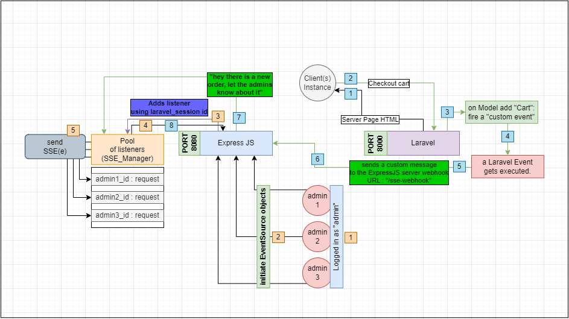

<br/>
<p align="center">
  <a href="https://github.com/0xW3ston/Operation-Fischer">
    
  </a>

  <h3 align="center">Fischer</h3>

  <p align="center">
    an E-Commerce website with basic features.
    <br/>
    <br/>
  </p>
</p>

    

## Table Of Contents

* [Built With](#built-with)
* [Unidirectional Real-Time Communcation](#unidirectional-real-time-communcation)
* [About the Project](#about-the-project)
* [Getting Started](#getting-started)
  * [Prerequisites](#prerequisites)
  * [Installation](#installation)
* [Roadmap](#roadmap)
* [License](#license)
* [Authors](#authors)

## Built With

Due to my focus on Real-Time communication. I ended up using:

* [Laravel v10](https://blog.laravel.com/laravel-v10-released)
* [ExpressJS & NodeJS](https://expressjs.com/)
* [MySQL](https://www.mysql.com/)
* [Server-Sent Events (EventSource)](https://developer.mozilla.org/en-US/docs/Web/API/EventSource)

## Unidirectional Real-Time Communcation


This section provides an overview of how real-time order notifications are implemented in our application using ExpressJS and the EventSource API. This feature ensures that admins are instantly notified of new orders as they are added to the system.

### Client (in blue):

1. **User Interaction**: When a client visits the website's homepage ("/"), they can interact with the site, including logging in, adding items to their cart, and proceeding to checkout.

2. **Custom Event Trigger**: After the client checks out their cart, our centralized server triggers a custom event named "CommandeAdded" upon inserting the order into the "Cart" Model.

3. **Event Activation**: The "commandeAdded" event is activated in response to the new order.

4. **Listener Execution**: The "sendNewNotification" listener is executed as a result of the "commandeAdded" event.

5. **REST API Request**: The "sendNewNotification" listener sends an HTTP GET request to our ExpressJS server at "x.x.x.x:8080/sse-webhook" to notify all admins in real-time about the new order.

6. **Server Acknowledgment**: Our ExpressJS server acknowledges the REST API request it receives.

7. **Publishing Data**: The server calls a specific static class method, following the Observer Pattern design pattern, to publish the new order information to all registered subscribers (admins).

8. **Real-time Update**: As soon as the method to publish the new information is executed, all subscribed admin instances receive a new data stream through their respective EventSource request objects.

### Admin (in orange):
1. **Admin Login**: An admin logs in to their admin portal ("/admin/" or "/admin/login").

2. **Dashboard Initialization**: Upon reaching the dashboard page, a JavaScript code initializes the EventSource object to expect real-time unidirectional messages from the ExpressJS server.

3. **Request Object Identification**: ExpressJS associates each EventSource request object with an identifier, typically the laravel_session ID of the admin's page.

4. **Real-time Updates**: Each EventSource request object of every admin continuously receives a stream of data containing new order information as it is published.
By leveraging ExpressJS and EventSource, we ensure that admins are promptly informed of new orders as they occur, enhancing the efficiency of order management.

## About The Project

|  |  |
| ------------------------------------------------------------- | ----------------------------------------------------------- |
|   |     |
|    |  |
|    |    |
|    |                                                            |

Regarding this project, it was made to make somewhat of an abstract e-commerce website.

## Getting Started

In order to test this project locally you need to follow the steps below

### Prerequisites

This is an example of how to list things you need to use the software and how to install them.

* php 8.1

* npm

* composer

### Installation

1. Clone the repo

```sh
git clone https://github.com/0xW3ston/Operation-Fischer.git
```

2. Install NPM packages

```sh
npm install
```

3. Install Composer Packages

```sh
composer install
```

4. Configure database:

```
DB_DATABASE=db_ecommerce (for exmpl)
DB_USERNAME=root
DB_PASSWORD=
```

5. run migrations and run this to create an admin user (in the terminal):
```sh
php artisan migrate:install
```
```sh
php artisan tinker
```

*and then:*

```php
App\Models\User::create(["name" => "admin", "username" => "admin", "password" => "admin", "role" => "admin"])
```

6. Start up The Server (Laravel:port8000 & Express:port8080):
```sh
php artisan serve
```
```sh
    node express.js
```
```sh
   npm run dev
```

## Roadmap

It is obvious that this project requires more work in order for it to be stable or/and optimized so it would be much appreciated to express issues or suggestions in the Issues page : )
- See the [open issues](https://github.com/0xW3ston/Operation-Fischer/issues) for a list of proposed features (and known issues).

## Authors

* **Youssef El Idrissi** - *Software Engi. Student* - [0xW3ston](https://github.com/0xW3ston/)
